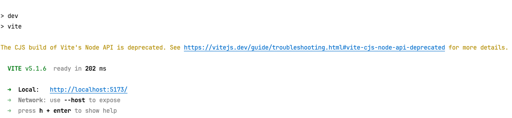
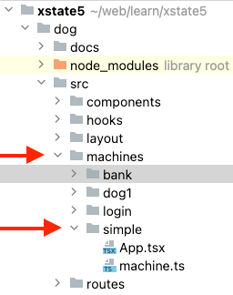
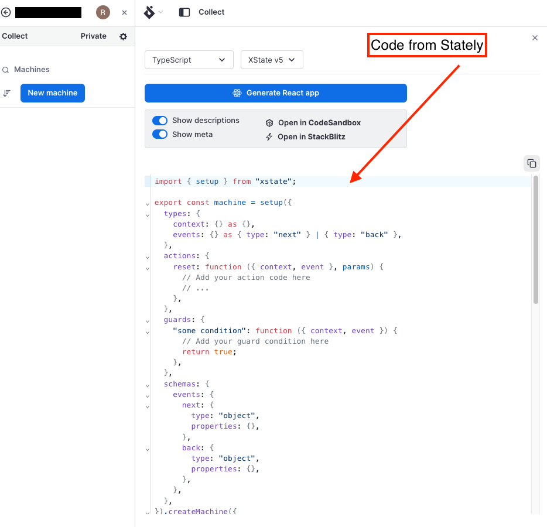

## About This Tool

This tool was built to debug and learn XState (https://xstate.js.org/) and Stately (https://stately.ai/).

### Installing

1. Clone/download this repo
2. run `npm install`

### Running

run `npm run dev`

output:


### TL;DR

Copy a directory in `src/machines`. Update the `machine.ts`. Update `src/routes/routes.tsx`.

### Adding a machine

1. Create a directory `src/machines`
2. Add a `App.tsx` file
3. Add a `machine.ts` file
4. Add to routes `src/routes/routes.tsx`



#### App.tsx file

The App.tsx file is the UI for the application. It must include the useStateMachineDebugger() hook. The first parameter is the machine exported from the `machine.ts` file. The second parameter is optional and is meta/reference information that will display in the state tab.

```
import React from 'react';
import { machine } from './machine';
import useStateMachineDebugger from '../../hooks/useStateMachineDebugger';

export default function App() {
  const { state, actor, send } = useStateMachineDebugger(machine, {
    meta: 'example',
    ref: 'unknown',
  });

  console.log({ state, actor, send });

  return <div>no ui</div>;
}

```

#### machine.ts file

Export your machine from this file. I used the `set().createMachine()` method to create a machine, other methods might work. You can copy a machine from Stately.



#### Add to routes

Add a route to the routes file `src/routes/routes.tsx` The **path** (browser route) and **id** should be unique compared to other routes. Point the **lazy: getComponent()** function to your App component.

```
  {
    path: '/atm',
    id: 'atm',
    lazy: () => getComponent('../machines/bank/App'),
  },
```

### TODO:

#### Add eslint

https://willadams.dev/articles/add-eslint-to-vite/

#### Explain how to use

App is a work in progress, still learning and adding features.
